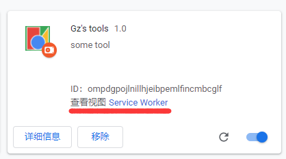
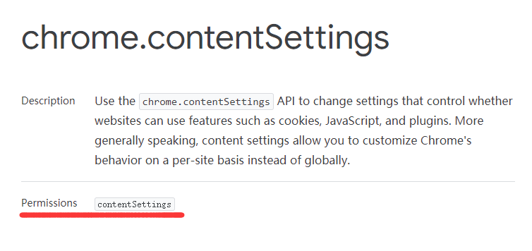
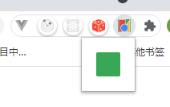
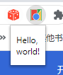
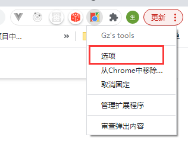
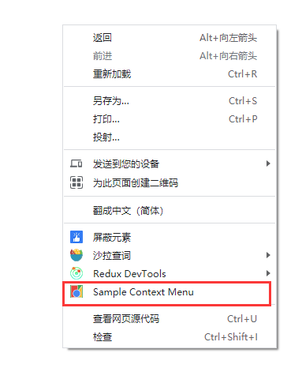

## 前言

记录一下插件的开发过程，后期作为文档查阅。

## manifest.json

每个扩展都有一个 JSON 格式的清单文件，名为`manifest.json`，提供重要信息。

### background

```json
 "background": {
    "service_worker": "background.js",
    "type": "module" // 支持 ES Module
  }
```

`background`此字段使用`service_worker`指定单个 JavaScript 文件的键。这个 js 会在启动插件时运行。其运行日志可以在这里看到




在此JS中无法操作DOM。因为Service Worker是一种特殊的Web Worker。也不再提供`XMLHttpRequest`，而是支持更现代的`fetch()`

我们可以在这个 js 里面做一些初始化工作。

### permissions 权限声明

使用一些 API 的时候，需要提前声明一下（获取权限）。具体参考需要使用的 API。红色部分就是需要声明的权限。



如上图所示，使用`chrome.contentSettings`API时就需要声明`contentSettings`权限

```json
  // manifest.json
  permissions: ["contentSettings"]
```

### action (图标弹窗)

控制 Google Chrome 工具栏中的扩展程序图标，以及弹窗显示的内容



```json
"action": {
    "default_icon": {              // optional
      "16": "images/icon16.png",   // optional
      "24": "images/icon24.png",   // optional
      "32": "images/icon32.png"    // optional
    },
    "default_title": "Click Me",   // optional, shown in tooltip
    "default_popup": "popup.html"  // 点击后显示的页面，最小25*25，最大800*600
  }
```

`default_popup`配置项：当用户单击工具栏中的扩展程序的操作按钮时，将显示一个操作的弹出窗口。弹出窗口可以包含您喜欢的任何 HTML 内容，并且会自动调整大小以适合其内容。弹出窗口不能小于 25x25，也不能大于 800x600。

#### demo

```json
//  manifest.json
{
  "name": "Gz's tools",
  "description": "some tool",
  "version": "1.0",
  "manifest_version": 3,
  "background": {
    "service_worker": "background.js"
  },
  "action": {
    "default_popup": "popup.html",
    "default_title": "Click to view a popup",
    "default_icon": {
      "128": "/images/get_started128.png"
    }
  }
}
```

```html
<!-- popup.html -->
<!DOCTYPE html>
<html>
  <head>
    <style>
      html {
        min-height: 5em;
        min-width: 10em;
      }
    </style>
  </head>
  <body>
    <p>Hello, world!</p>
  </body>
</html>
```

此时弹窗的页面为： 

#### 写一个改变当前页面背景颜色的例子

```html
<!-- popup.html -->
<!-- html更改两行代码 -->
<body>
  <button id="changeColor"></button>
  <script src="./popup.js"></script>
</body>
```

```javascript
// popup.js 在这里注册事件

// 获取btn
let changeColor = document.getElementById('changeColor')

// When the button is clicked, inject setPageBackgroundColor into current page
changeColor.addEventListener('click', async () => {
  // 获取当前激活的页面
  let [tab] = await chrome.tabs.query({ active: true, currentWindow: true })
  // 传入函数
  chrome.scripting.executeScript({
    target: { tabId: tab.id },
    function: setPageBackgroundColor,
  })
})

// The body of this function will be executed as a content script inside the
// current page
function setPageBackgroundColor() {
  document.body.style.backgroundColor = 'green'
}
```

因为使用了上面的 chrome.xxx API,我们就需要到 manifest.json 声明对应的 permissions。

### options_page (右键选项)

#### 配置位置

```json
// manifest.json
{
  "options_page": "options.html"
}
```

#### 效果



点击选项即可弹出 options 页面，此页面会在新标签页面打开

### 右键上下文菜单



```js
// 注册
chrome.contextMenus.create({
  id: 'sampleContextMenu',
  title: 'Sample Context Menu',
  contexts: ['page'], // 触发的方式，如选中才触发
})
// 回调
chrome.contextMenus.onClicked.addListener((...arg) => {
  console.log(...arg)
})
```
