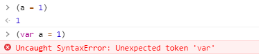
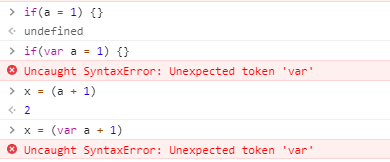
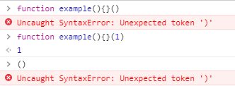

### ()的作用

小括号之间存放的必须是表达式，所以如果在小阔号里面定义一个函数，那么 V8 就会把这个函数看成是函数表达式，执行时它会返回一个函数对象。




### 表达式与语句

一般情况下，在js里每一行就是一个语句。

语句是为了完成某种任务而进行的操作，比如赋值语句：

```javascript
var a = 1+3;
```
在这条语句中，上面的1+3就是表达式。

语句和表达式的区别在于，语句是为了进行某种操作，一般情况下不需要返回值，而表达式都是为了得到返回值，一定会返回一个值（这里的值不包括undefined）。

### 判断表达式的方法

1. if判断
2. 变量赋值





### 自执行函数

大家都知道在函数后面增加()即可
我们来试试

```javascript
function example(){}()
// Uncaught SyntaxError: Unexpected token ')'
```

#### 为什么报错

因为在解析器解析全局的function或者function内部function关键字的时候，默认是认为function声明，而不是function表达式。

#### 执行过程

```javascript
function example(){}()
// 执行过程
// 其实是两部分执行 
// 第一部分
function example(){}
// 第二部分
()
// 报错就来自于第二部分 Unexpected token ')'
// 如果增加一个1就不会报错。而且这个example函数式没有执行的
function example(){}(1) // 1
// 后面只是一个毫不相干的表达式（分组操作符）
```



在一个表达式后面加上括号()，该表达式会立即执行，但是在一个语句后面加上括号()，是完全不一样的意思，他的只是分组操作符。

### 解决报错

我们只需要用大括弧将代码的代码全部括住就行了，因为JavaScript里括弧()里面不能包含语句，所以在这一点上，解析器在解析function关键字的时候，会将相应的代码解析成function表达式，而不是function声明。

```javascript
(function () { /* code */ } ()); // 推荐使用这个
(function () { /* code */ })(); // 但是这个也是可以用的
```

[参考](https://www.cnblogs.com/TomXu/archive/2011/12/31/2289423.html)